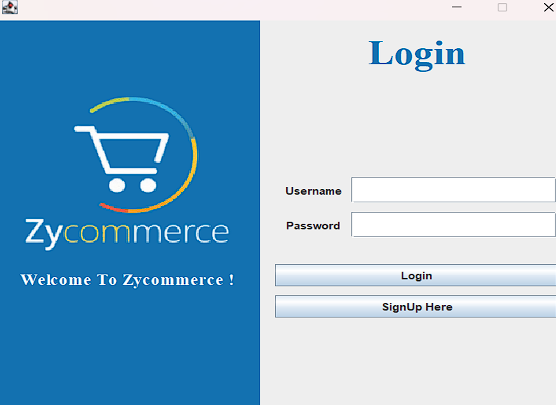
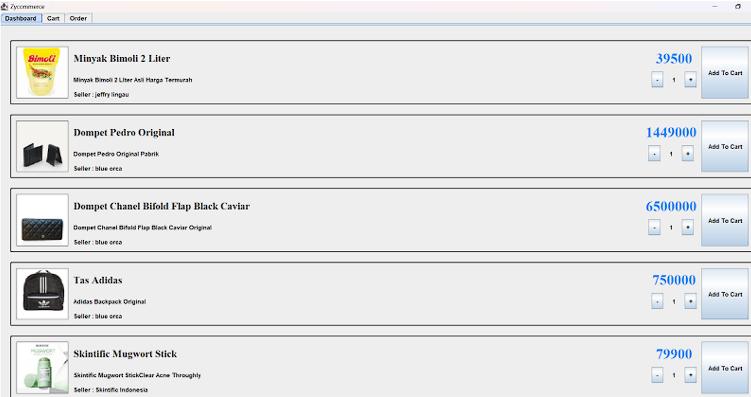
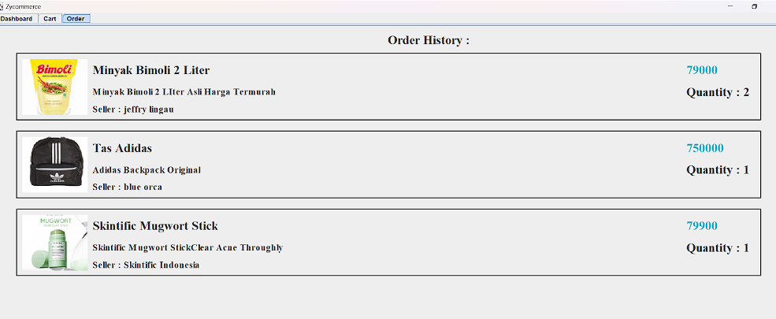

# Zycommerce (Cozy Commerce)
__Zycommerce__ merupakan sebuah aplikasi e-commerce
sederhana yang dikembangkan dengan menggunakan bahasa
Java dan juga MySQL.

## Teknologi Yang Dipakai 
* Java Swing
* sql2o
* package maven apache common codecs

## Fitur-fitur Zycommerce
* Pembelian barang-barang yang dilisting oleh penjual
* Pendaftaran menjadi seller independen
* Pengecekan order history pembeli
* CRUD produk oleh penjual

## Kelemahan Zycommerce
* Hanya dapat dirunning dari class Main dan bukan executables atau JAR karena tidak diimplementasi folder baru pada user home directory.
* Delay saat upload image karena program yang dirunning dari class Main tidak bersifat realtime untuk menampilkan gambar yang baru saja diupload.
* UI yang sederhana.
* Tampilan data penjualan dalam bentuk sederhana dan bantuan seperti chart (Dapat diimplementasi pada kemudian hari).

## Screenshot Tampilan Aplikasi

